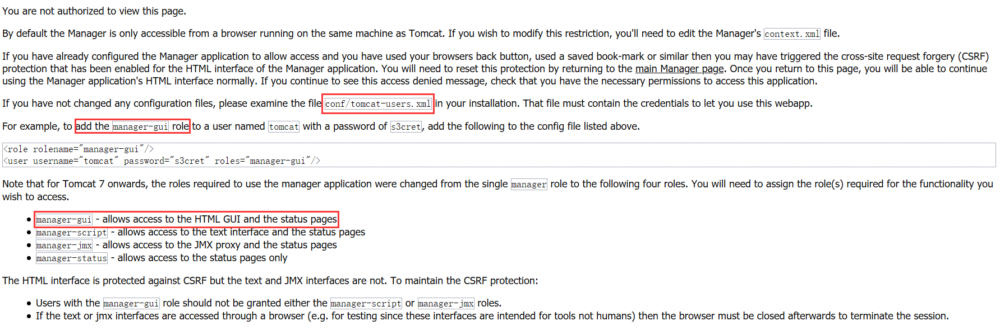

## Tomcat

### Tomcat 的目录结构

- bin：二进制可执行文件和脚本
- conf：配置文件目录
- lib：可加载的类目录
- logs：日志目录
- webapps：web 应用程序
- work：Tomcat 的工作目录（存放 jsp 产生的 class 文件）
- temp：存放临时文件


### Tomcat 配置文件

- conf/server.xml：服务器的主配置文件
- conf/web.xml：定义所有 web 应用的配置（默认的 Servlet 定义和 MIME 类型定义）
- conf/tomcat-user.xml：定义 tomcat 用户的信息


### 修改启动端口

打开 conf/server.xml 配置文件（**注意：在修改文件之前，先复制一份备份**），找到如下配置行：

```xml
<Connector port="8080" protocol="HTTP/1.1"
               connectionTimeout="20000"
               redirectPort="8443" />
```

将其中的 8080 端口修改成你想要的端口号。

**保存之后，重启 Tomcat**。


### 打开 Web 应用程序管理器

进入 Web 应用程序管理器之前，需要先修改 conf/tomcat-user.xml 配置文件（**注意：在修改文件之前，先复制一份备份**）。

按照官方提示进行修改：

