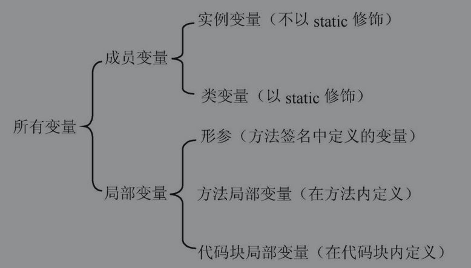

## 成员变量和局部变量

### 1. 成员变量和局部变量

#### 成员变量

**成员变量**指的是在**类**里定义的变量；**局部变量**指的是在**方法**里定义的变量。

成员变量被分为**类变量（使用 static 修饰）**和**实例变量**两种。

类变量从该类的准备阶段起开始存在，直到系统完全销毁这个类，类变量的作用域与这个类的生存范围相同；而实例变量则从该类的实例被创建起开始存在，直到系统完全销毁这个实例，实例变量的作用域与对应实例的生存范围相同。

#### 局部变量

- 形参：在整个方法内有效。
- 方法局部变量：从定义该变量的地方生效，到该方法结束时失效。
- 代码库局部变量：从定义该变量的地方生效，到该代码块结束时失效。

与成员变量不同的是，**局部变量除形参之外，都必须显式初始化**。也就是说，必须先给方法局部变量和代码块局部变量指定初始值，否则不可以访问它们。

### 2. 成员变量的初始化和内存中的运行机制

- 当系统**加载类**，系统自动为**类变量**分配内存空间，并在分配内存空间后，自动为类变量指定初始值。
- 当创建**类的实例**时，系统自动为**成员变量**分配内存空间，并在分配内存空间后，自动为类变量指定初始值。

### 3. 局部变量的初始化和内存中的运行机制

**局部变量定义后，必须经过显式初始化后才能使用**，系统不会为局部变量执行初始化。这意味着定义局部变量后，系统并未为这个变量分配内存空间，直到等到程序为这个变量赋初始值时，系统才会为局部变量分配内存，并将初始值保存到这块内存中。

与成员变量不同，局部变量不属于任何类或实例，因此它总是保存在其所在方法的栈内存中。

**栈内存中的变量无须系统垃圾回收，往往随方法或代码块的运行结束而结束**。