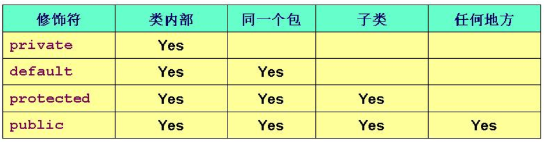

## 隐藏和封装

### 访问控制符

Java 提供了 3 种访问控制符：private、protected 和 public。

Java 提供了 4 中访问控制级别：private、protected、public 和不加任何访问控制符的访问控制级别（即默认级别, default）。

==Java 访问控制级别的大小：public > protected > default > private==。

4 个访问控制级别的详细介绍如下：

- private（当前类访问权限）：只能在当前类中访问。
- default（包访问权限）：同一个包下可以访问。
- protected（子类访问权限）：可以被同一个包中其它类访问，也可以被不同包中的子类访问。
- public（公共访问权限）：可以被所有类访问。



**注意**：

用于修饰类的访问控制符只能是 public，类的访问控制级别可以是：

- public：公开访问。
- default：同一个包类可以访问。


### Package 和 import

#### 1. Package

Java 引入包（package）机制，提供了类的多层命令空间，用于解决类的命名冲突、类文件管理等问题。

如果将类放在指定的包结构下，应该在源文件的第一行编写如下代码：

```java
package packageName;
```

使用了 package 语句，也就意味着==该源文件中的所有类都是属于这个包==。

==位于包中的每个类的完整类名都应该是包名和类名的组合，如果需要使用该包下的类，也应该使用包名加类名的组合==。

==位于包中的类，在文件系统中也必须有与包名层次相同的目录结构==。

==虚拟机在装载带包名的类时，会先搜索 CLASSPATH 环境变量指定的目录，然后在这些目录中按照与包层次对应的目录结构去查找 class 文件==。

同一个包中类不必位于相同的目录下，只要 CLASSPATH 环境变量中包含这些路径即可。虚拟机会自动搜索 CLASSPATH 下的子路径，把它们当作同一个包中的类来处理。

#### 2. import

使用 import 语句导入单个类的用法如下：

```java
import package.subpackage...ClassName;
```

使用 import 语句导入指定包下全部类：

```java
import package.subpackage...*;
```

==注意：（*）只能代表类，不能代表包==。例如 `import java.util.*` 语句只会导入 util 包下的所有类，而不会导入 util 子包下的类。

#### 3. import static

==Java 5 以后增加了静态导入的语法，它用于导入指定类的某个静态成员变量、方法或者全部的静态成员变量、方法==。

导入指定类的某个静态成员、方法的语法为：

```java
import package.subpackage...ClassName.fildName | methodName;
```

导入指定类的所有静态成员、方法的语法为：

```java
import package.subpackage...ClassName.*;
```


### Path 和 CLASSPATH

#### Path

Path 环境变量用于指定命令行中运行命令的路径。

==系统执行用户命令时，若用户未给出绝对路径，则首先在当前目录下寻找相应的可执行文件、批处理文件（另一种可以执行的文件）等。若找不到，再依次在 Path 保存的这些路径中寻找相应的可执行文件。系统就以第一次找到的为准；若搜寻完 Path 保存的所有路径都未找到，则报错==。


#### CLASSPATH

CLASSPATH 是 javac 编译器的一个环境变量。它的作用就是指定类搜索路径，与 import 和 package 关键字有关。

当编译器面对 `import java.util.*` 这个语句时，它会先查找 CLASSPATH 所指定的路径，并且检查子目录 	java/util 是否存在，然后找到名称吻合的已编译文件（.class 文件）。如果没有则报错。

**对于 jar 文件需要注意：必须将 jar 文件的名字置于类路径里，而不仅仅是它所在的路径**。

