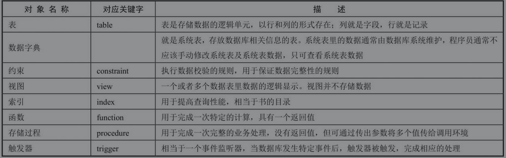
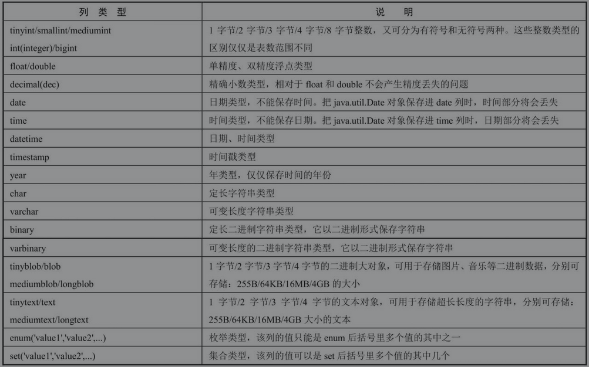

## 1. MySQL 基本命令

- 创建新的数据库：

```sql
create database [IF NOT EXISTS] 数据库名称;
```

添加 `IF NOT EXISTS` ，则当数据库已经存在时，并不会报错。


- 删除指定数据库：

```sql
drop database 数据库名称;
```


- 进入指定数据库：

```sql
use 数据库名称;
```


- 查询该数据库下包含多少数据表：

```sql
show tables;
```


- 如果想查看指定数据表的表结构（表有多少列，每一列的数据类型等信息）：

```sql
desc 表格名称;
```

其中 `desc` ，全称 description。


## 2. SQL 语法基础

标准的 SQL 语句通常可分为如下几种类型：

- 查询语句：select
- DML（Data Manipulation Language）数据库操作语言：insert、update、delete
- DDL（Data Definition Language）数据库定义语言：create、alter、drop、truncate
- DCL（Data Control Language）数据库控制语言：grant、revoke
- 事务控制语句：commit、rollback 和 savepoint


## 3. DDL 语句

数据库包含如下几种常见的数据库对象：




- 创建表的语法：

  ```sql
  create table [模式名.]表名(
  	第一列名称 类型 [default expr],
      ...
  )
  ```

  子查询建表语句：

  ```sql
  create table [模式名.]表名 [column [, column...]]
  as 子查询语句;
  ```

  

MySQL 支持如下几种列类型：




- 修改表结构的语法：

  - 添加列：

  ```sql
  alter table 表名
  add(
  	列名称 类型 [default expr],
      ...
  );
  ```

  - 修改列定义：

  ```sql
  alter table 表名
  modify 列名 类型 [default expr] [first | after 列名]；
  ```

  - 删除列

  ```sql
  alter table 表名
  drop 列名；
  ```

  - 重命名数据表：

  ```sql
  alter table 表名
  rename to 新名称;
  ```

  - 改变列名：

  ```sql
  alter table 表名
  change 旧列名 新列名 类型 [default expr] [first | after 列名]
  ```


- 删除表的语法：

  ```sql
  drop table 表名;
  ```


## 4. 数据库约束

五种完整性约束：

- NOT NULL：非空约束，指定某列不能为空。
- UNIQUE：唯一约束，指定某列或者几列组合不能重复。
- PRIMARY KEY：主键，指定该列的值可以唯一地标识该条记录。
- FOREIGN KEY：外键，指定该行记录从属于主表中的一条记录，主要用于保证参照完整性。
- CHECK：检查，指定一个布尔表达式，用于指定对应列的值必须满足表达式。（**MySQL 不支持**）


#### NOT NULL

