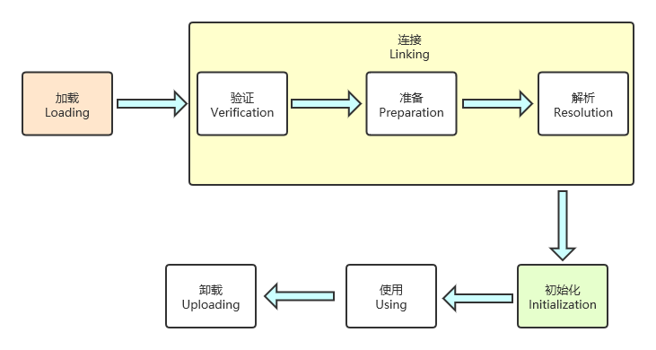

## 类加载、连接、初始化

当程序主动使用某个类时，如果该类还未被加载到内存中，则系统会通过**加载、连接、初始化**三个步骤来对该类进行初始化。如果没有意外，JVM 将会连续完成这三个步骤，所以有时也把这三个步骤统称为类加载或类初始化。

### 类加载

**类加载指的是将类的 class 文件（磁盘或者网络上）读入内存，并为之创建一个 java.lang.Class 对象**，也就是说，当程序中使用任何类时，系统都会为之建立一个 java.lang.Class 对象。**一旦一个类被载入 JVM 中，同一个类就不会被再次载入了**。

> **注意：所有的类都是 java.lang.Class 的实例对象**。

**类的加载由类加载器完成**，类加载器通常由 JVM 提供，JVM 提供的这些类加载器通常被称为**系统类加载器**。除此之外，**开发者可以通过继承 ClassLoader 基类来创建自己的类加载器**。

**类加载器通常无须等到“首次使用”该类时才加载该类，Java虚拟机规范允许系统预先加载某些类**。

### 连接

**连接阶段负责把类的二进制数据合并到 JRE 中**。类连接分为三个阶段：

- 验证：检验被加载的类是否符合 JVM 规范。
- 准备：**类准备阶段则负责为类的类变量（static）分配内存，并设置默认初始值**。
- 解析：将类的二进制数据中的符号引用替换成直接引用。

### 初始化

**在类的初始化阶段，虚拟机负责对类进行初始化，主要就是对类变量（static）进行初始化**。在类的初始化阶段,对类变量（static）指定初始值有两种方式：

- **声明**类变量时指定初始值；
- 使用**静态初始化块**为类变量指定初始值。

==声明变量时指定初始值，静态初始化块都将被当成类的初始化语句，JVM 会按这些语句在程序中的**排列顺序依次执行**它们==。

JVM 初始化一个类包含如下几个步骤：

- 假如这个类还没有被加载和连接，则程序先加载并连接该类。
- 假如该类的直接父类还没有被初始化，则**先初始化其直接父类**。（所以 JVM 最先初始化的总是java.lang.Object 类）
- 假如类中有初始化语句，则系统依次执行这些初始化语句。

### 类初始化的时机

当 Java 程序首次通过下面 6 种方式来使用某个类或接口时，系统就会初始化该类或接口：

- 创建类的实例。
  - 使用 **new** 操作符来创建实例。
  - 通过**反射**来创建实例。
  - 通过**反序列化**的方式来创建实例。
- 调用某个类的类方法（静态方法）。
- 访问某个类或接口的（static）类变量（**final 修饰的宏变量除外**：对于一个 final 修饰的类变量，如果**该类变量的值在编译时就可以确定下来**，那么这个类变量相当于“宏变量”），或为该类变量赋值。
- 使用**反射方式来强制创建某个类或接口对应的 java.lang.Class 对象**。
- 初始化某个类的子类。当初始化某个类的子类时，该子类的所有父类都会被初始化。
- 直接使用 java.exe 命令来运行某个主类。当运行某个主类时，程序会先初始化该主类。

**注意**：当使用 ClassLoader 类的 loadClass() 方法来加载某个类时，该方法只是加载该类，并不会执行该类的初始化。使用 Class 的 forName() 静态方法才会导致强制初始化该类。