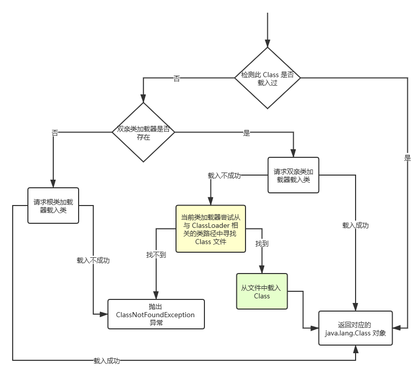

## 类加载器

### 类加载机制

类加载器负责加载所有的类，系统为所有被载入内存中的类生成一个 java.lang.Class 实例。一旦一个类被载入 JVM 中，同一个类就不会被再次载入了。现在的问题是，**怎么样才算“同一个类”？**

在 Java 中，一个类用其全限定类名（包括包名和类名）作为标识；但**在 JVM 中，一个类用其全限定类名和其类加载器作为唯一标识**。

JVM 启动时，会形成由三个类加载器组成的初始类加载器层次结构：

- Bootstrap ClassLoader：根类加载器（不是用 Java 编写）。它**负责加载 Java 的核心类**。==在 Sun 的 JVM 中，当执行 java.exe 命令时，使用 -Xbootclasspath 或 -D 选项指定 sun.boot.class.path 系统属性值可以指定加载附加的类==。
- Extension ClassLoader：扩展类加载器。
- System ClassLoader：系统类加载器。

JVM 的类加载机制主要有如下三种：

- 全盘负责：一个类加载器负责加载某个Class时，该Class所依赖的和引用的其他Class也将由该类加载器负责载入，除非显式使用另外一个类加载器来载入。
- **双亲委派**：先让 parent （双亲）类加载器试图加载该Class，只有在父类加载器无法加载该类时才尝试从自己的类路径中加载该类。
- 缓存机制：缓存机制将会保证所有加载过的Class都会被缓存，当程序中需要使用某个Class时，类加载器先从缓存区中搜寻该Class，只有当缓存区中不存在该Class对象时，系统才会读取该类对应的二进制数据，并将其转换成Class对象，存入缓存区中。

类加载器加载Class大致要经过如下 8 个步骤：

允许重写 ClassLoader 的 findClass() 方法来实现自己的载入策略，甚至重写 loadClass() 方法来实现自己的载入过程。