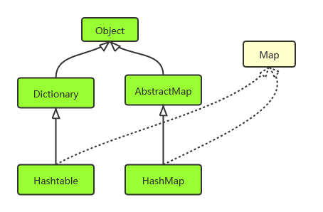

## java.util.HashMap

参考：https://www.jianshu.com/p/ee0de4c99f87

#### 要点

- HashMap 实现了 Map 接口。
- HashMap 支持 null 键和 null 值。
- **HashMap 基本上和 HashTable 相当，但是 HashMap 是非同步的（非线程安全）且支持 null 键和 null 值**。
- HashMap **不能够保证**随着时间的推移其中的**元素的次序不变**。
- JDK 5 提供了 ConcurrentHashMap，它是 HashTable 的替代，比 HashTable 扩展性更好。

### HashMap 实现原理

#### JDK 7 之前

数组 + 链表

#### JDK 8 之后

数组 + 链表 + 红黑树

- 链表插入快，搜索慢
- 红黑树插入慢，搜索快
- 当链表长度大于等于 7 之后，改成使用红黑树 

