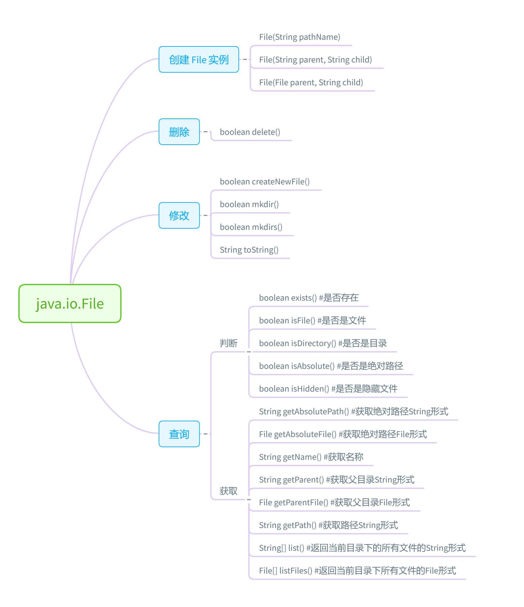

# java.io.File



## 示例

### 遍历打印目录结构

```java
import java.io.File;


class IterativeDirectory{
	public static void main(String[] args){
		File file = new File("C:/Users/monkeyknight/Documents/LearnMe/GitRepositories/OfferMe2020/test");
		if(file.exists()){
			System.out.println(file.getName());
			searchDirectory(file, 1);
		}else{
			System.out.println("输入文件不存在，请核实是否输入正确！");
		}
	}

	public static void searchDirectory(File directory, int level){
		File[] childs = directory.listFiles();
		for (int i = 0; i < childs.length; i ++){
			printSpace(level);
			System.out.println(childs[i].getName());
			if(childs[i].isDirectory()){
				searchDirectory(childs[i], level + 1);
			}
		}
	}

	public static void printSpace(int level){
		for (int j = 0; j < level; j ++){
			System.out.print("    ");
		}
	}
}
```

