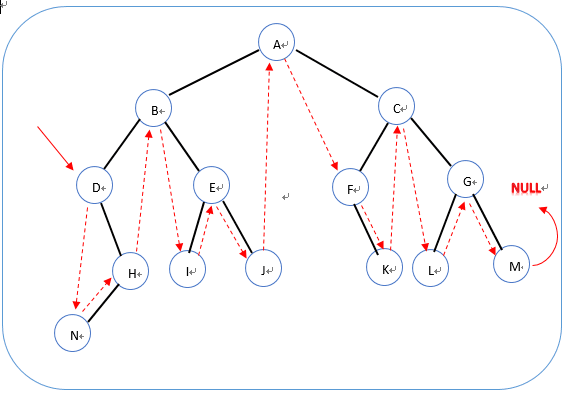

## 二叉树的下一个节点

### 题目描述

给定一个二叉树和其中的一个结点，请找出中序遍历顺序的下一个结点并且返回。注意，树中的结点不仅包含左右子结点，同时包含指向父结点的指针。

### 题目分析

给定的节点可以分成如下几种情况：

- 叶子结点（无孩子结点）：
  - 是一个左孩子结点，则下一个为其父结点。
  - 是一个右孩子结点，递归向上找祖先结点，直到该祖先结点为某个X结点左孩子结点，则下一个结点为X结点。
- 非叶子结点（有孩子结点）：
  - **有左孩子结点和右孩子结点，下一个结点为右子树最左的一个结点**
  - 只有左孩子结点
    - 是左孩子结点，则为其父结点
    - 是右孩子结点，递归向上找祖先结点，直到该祖先结点为某个X结点左孩子结点，则下一个结点为X结点。
  - **只有右孩子结点，下一个结点为右子树最左的一个结点**


进一步总结：

- 有右子树：那么下个结点就是右子树最左边的点；
- 无右子树：
  - 是左孩子结点，那么下一个结点就是父结点。
  - 是右孩子结点，向上找到其祖先结点中为左孩子的结点，那么下一个结点为此祖先结点的父结点；如果没有，则此结点为中序遍历的最后一个结点。



### 代码实现

```java
/*
public class TreeLinkNode {
    int val;
    TreeLinkNode left = null;
    TreeLinkNode right = null;
    TreeLinkNode next = null;

    TreeLinkNode(int val) {
        this.val = val;
    }
}
*/
public class Solution {
    public TreeLinkNode GetNext(TreeLinkNode pNode)
    {
        /*如果结点为空，直接返回*/
        if(pNode == null){
            return null;
        }
        
        /*有右子树*/
        if(pNode.right != null){
            TreeLinkNode next = pNode.right;
            while(next.left != null){
                next = next.left;
            }
            return next;
        }
        /*无右子树*/
        while(pNode.next != null){
            /*
            * 若为左孩子，直接返回父亲结点；
            * 若为右孩子，向上找祖先结点（为某一个结点的左孩子）*/
            if(pNode == pNode.next.left){
                return pNode.next;
            }
            pNode = pNode.next;
        }
        /*向上找不到祖先结点为某个结点左孩子结点，返回空*/
        return null;
    }
}
```

