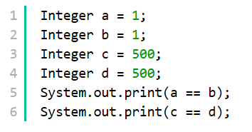
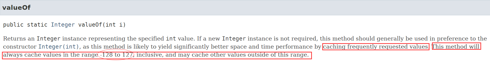

1. java.util.ConcurrentHashMap、java.util.HashTable 提供了基本的多线程安全支持；java.util.HashMap、java.util.TreeMap、java.util.SortMap 则没有提供多线程安全支持。

2. List 泛型之间相互赋值的要点：**点、范围**：
   - 尖括号里面是一个具体类，那么尖括号里面的就是一个点。比如：`List<A>`，`List<B>`，`List<Object>`。
   - 如果尖括号里面带有问号，那么尖括号里面就是一个范围。`<? extends A>` 表示小于 A 的范围，`<? super A>` 表示大于 A 的范围，`<?>` 表示全部范围。
   - 不同的点之间相互赋值是**错误的**。
   - 尖括号小范围赋值给大范围，对；大范围赋值给小范围，错；如果某点包含在某个范围里，那么可以赋值，否则不能赋值。
   - `List<?>` 和 `List` 是相等的，代表最大范围。
   - `List` 既是点也是范围，当表示范围时，表示最大范围。
   
3. 如下代码的运行结果为：

   

   赋值符号（"="）调用的是 Integer 类的 valueOf() 方法，查看官方文档的 valueOf() 方法的解释如下：

   

   即，Integer 类会缓存 [-128, 127] 之间的值得实例，在这个区间类调用 valueOf() 方法不会生成新的实例。

