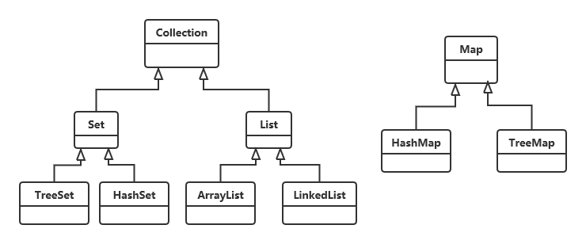

# OfferMe2020
整理计算机专业复习要点、面试题、以及牛客和 `LeetCode` 上在线编程题

## 计算机网络

- [计算机网络性能指标](./net_0001.md)
- [计算机网络性能指标习题](./net_0002.md)

## Redis

- Redis 简介

## Java

### java 入门

- 数据类型
  - 基本数据类型
    - java 语言整型默认 int 类型，如果要定义 double 类型，必须在数字后面加上 "l" 或者 "L"；
    - java 语言浮点类型默认 double 类型，如果要定义 float 类型，必须在数字后面加上 "f" 或者 “F”；
    - byte, short, char 类型之间不会相互转换，他们三者在计算时首先会
    - 转换成 int 类型；

- 面向对象编程

  - 在定义成员变量的时候可以对其进行初始化，如果不对其进行初始化，java 会对其进行默认初始化。

  - 如何区分类和对象？

    - 类是静态的概念，位于代码区。（Code Segment）
    - 对象是 new 出来的，位于堆内存。**每个成员变量在不同对象中都有不同的值（除了静态变量），而方法只有一份，执行的时候才占用内存**。

  - static 静态变量、常量，位于数据区（Data Segment）

  - 为了管理大型软件系统中数目众多的类，解决类的命名冲突问题，java 引入了包（package）机制，提供类的多重类命名空间。

    - 如果要把一个类放到包里面，类源码文件的第一行代码为 package ...
    - 编译出来的 .class 文件必须位于正确的目录（和源码文件中指定的包的层次必须一致）下面。
    - 引入一个包使用 import 关键字。或者在类前写全包名。
    - 在 A.class 类中访问 com.test.B.class 类，必须保证 A.class 与 com 位于同一级目录下；或者指定环境变量 classpath 路径到 B.class 类文件的最上面一层包的父目录。

  - 继承中的构造方法

    - 子类的构造过程中**必须**调用其基类的构造方法。

    - 子类可以在自己的构造方法中使用 `super(args)` 来调用基类的构造方法。

      -> `this(args)` 调用本类其它的构造方法。

      > 注意：以下方式为错误的
      >
      > ```java
      > public class Base{
      >     public Base(int a){
      >         
      >     }
      >     
      >     public Base(int a, int b){
      >         Base(a); // 错误的，在一个构造方法中调用另一个构造方法，应该使用 this(args) 方法。
      >         this(a); // 正确的。
      >     }
      > }
      > ```
      >
      > 

      -> 如果调用了 `super(args)`，必须写在子类构造方法中的第一行。

    - 如果子类的构造方法中没有显示的调用基类的构造方法，则系统**默认调用基类无参数**的构造方法。

    - 如果子类构造方法中既没有显示调用基类构造方法，而基类没有无参数的构造方法，则编译出错。

  - 动态绑定和多态

    - 动态绑定是指在执行期间（而非编译期间）判断所引用的对象的实际类型，根据其实际的类型调用其相应的方法。

  - 抽象类

    - 用 abstract 关键字修饰的类为抽象类；用 abstract 关键字修饰的方法为抽象方法
    - 含有抽象方法的类**必须**被声明为抽象类，抽象类**必须**被继承，抽象方法**必须**被重写。
    - 抽象类不能被实例化。
    - 抽象方法只需要被声明，不需要被实现。

  - final 关键字

    - final 修饰的变量不能被修改
    - final 修饰的方法不能被重写
    - final 修饰的类不能被继承
    
  - Inteface（接口）

    - Interface（接口）是**抽象方法**和**常量值**的定义的集合。

    - 从本质上讲，接口是一种**特殊的抽象类**，这种抽象类中**只有常量和方法的定义，而没有变量和方法的实现**。

    - 接口的成员变量是 `public static final` 修饰的。是为了修正 C++ 多继承中问题（多个父类有相同的成员变量时，会很复杂并且容易出现问题）。**接口的成员变量默认是 `public static final` ，而且也必须是 `public static final`。接口的成员方法默认是 `public abstract` 的，且必须是 `public abstract` 的。**

      

- 常用类
  - [String 字符串类](./java/introduction/FrequentlyUsedClasses/01.md)
  - [StringBuffer 类](./java/introduction/FrequentlyUsedClasses/02.md)
  - [Math 数学类](./java/introduction/FrequentlyUsedClasses/04.md)
  - [File 文件类](./java/introduction/FrequentlyUsedClasses/03.md)
  - Enum 枚举类
  - 基本数据类型包装类
    - Byte
    - Boolean
    - Short
    - Character
    - Integer
    - Float
    - Double
  
- 容器
  - 集合类图

    

  - Collections 类

  - Collection 接口

  - Set 接口

  - List 接口

  - Map 接口

  - Iterator 接口

  - Comparable 接口

  - [自动打包、解包](./java/introduction/Container/0001.md)

  - [泛型](./java/introduction/Container/0002.md)

  - ArrayList 

  - LinkedList

  - 如何选择数据结构？

    - Array 开头的数据结构（ArrayList）读的快，写的慢
  - Linked 开头的数据结构（LinkedList）写的快，读的慢
    
- Hash 开头的数据结构位于上述两者之间。（HashSet, HashMap）
    
  - Stack
  
  - HashMap
  
  - TreeMap
  
  - TreeSet
  
  - HashSet
  
- IO
  - [初识 IO 流, InputStream, OutputStream, Reader, Writer 四个基本抽象类](./java/introduction/IO/01.md)。
    - 视频资料：https://pan.baidu.com/s/1gLE9aQpd1hTReErlnJO-qg （提取码：233c）
  - FileInputStream, FileOutputStream 两个文件字节流。（**节点流**）
    - 测试代码：[FileInputStream](./java/introduction/TestCode/src/IO/TestFileInputStream.java), [FileOutputStream](./java/introduction/TestCode/src/IO/TestFileInputStream.java)
    - 视频资料：https://pan.baidu.com/s/1-EMere1aEVPk6WQv_Q3Vxg （提取码：qc3x）
  - FileReader, FileWriter 两个文件字符流。（**节点流**）
    - 测试代码：[FileReader](./java/introduction/TestCode/src/IO/TestFileReader.java), [FileWriter](./java/introduction/TestCode/src/IO/TestFileWriter.java)
    - 视频资料：https://pan.baidu.com/s/1XDNEe5ygFmRH80ETcmUQIw （提取码：m8mz）
  - BufferedInputStream, BufferedOutputStream 两个带缓冲区的字节流。（**处理流**）
    - 测试代码：[BufferedInputStream](./java/introduction/TestCode/src/IO/TestBufferenInputStream.java), [BufferedOutputStream](./java/introduction/TestCode/src/IO/TestBufferedOutputStream.java)
    - 视频资料：https://pan.baidu.com/s/1qfN8sfqaQqLal-T4Lchlpw （提取码：du4e） 
  - BufferedReader, BufferedWriter 两个带缓冲区的字符流。（**处理流**）
    - 测试代码：[BufferedReader](./java/introduction/TestCode/src/IO/TestBufferedReader.java), [BufferedWriter](./java/introduction/TestCode/src/IO/TestBufferedWriter.java)
    - 视频资料：https://pan.baidu.com/s/1qfN8sfqaQqLal-T4Lchlpw （提取码：du4e） 
  - InputStreamReader, OutputStreamWriter 两个字节流转换成字符流的转换流。（**处理流**）
    - 测试代码：[InputStreamReader](./java/introduction/TestCode/src/IO/TestInputStreamReader.java), [OutputStreamWriter](./java/introduction/TestCode/src/IO/TestOutputStreamWriter.java)
    - 视频资料：链接：https://pan.baidu.com/s/1gtR3e3sibtfa9Dsg40ZJDw （提取码：qk6p ）
  - ByteArrayInputStream, ByteArrayOutputStream 两个内存字节数组字节流。（**节点流**）
  - DataInputStream, DataOuputStream 两个基本数据类型字节流。（**处理流**）
  - PrintStream, PrintWriter 打印流。（**处理流**）
  - ObjectInputStream, ObjectOutputStream 两个对象字节流。（**处理流**）
    - Serializable 接口
    - Externalizable 接口
    - Transient 关键字

### JVM


## 数据结构与算法

- [排序算法](./DataStructureAndAlgorithm/01.md)

## C、C++

- [struct 大小的计算](./c_c++_0001.md)
