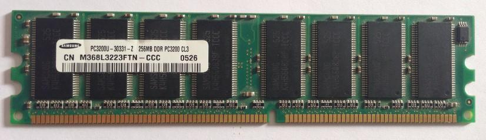
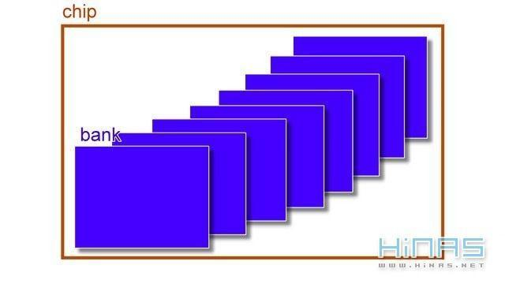
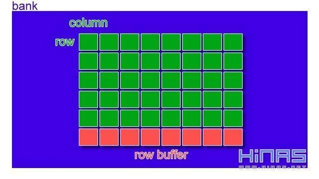
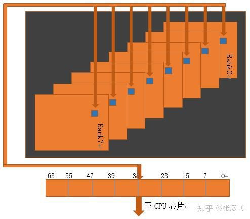

# 结构体（struct）大小的计算

### 目录

- 为什么内存地址以字节为单位？

- 从底层理解为什么需要字节对齐
- 结构体字节对齐的规则是什么？

### <a name="">为什么内存地址以字节为单位？

#### 为什么 $C$ 语言中内存地址 `0x0001​` 和内存地址 `0x0002` 之间相差的是一个 `byte`，而不是一个 `bit`？

首先了解一下内存的物理结构，如下图所示：

从上图可以看出，内存由多个黑色小长方形组成，一个黑色小长方形称为一个 `chip`。上面这个内存条由 $8$ 个 `chip` 构成。

每一个 `chip` 又是由 $8$ 个 `bank` 组成。其结构如下图所示：

每一个 `bank` 都是电容的行列矩阵，如下图所示：

**注意：二维矩阵中的一个元素一般存储着 $8 \, bit$，也就是说包含了 $8$ 个小电容。**

那么对于我们在应用程序中内存中地址连续的 $8$ 个字节，例如`0x0000`-`0x0007`，直观感觉，应该是在第一个 `bank` 上吗？  其实不是，程序员视角看起来连续的地址 `0x0000`-`0x0007`，实际上位于 $8$ 个 `bank` 中同行同列的位置上。在物理上，他们并不连续。下图很好地阐述了实际情况：

为什么？，原因是电路工作效率。内存中的 $8$ 个 `bank` 是可以并行工作的。  如果你想读取址 `0x0000`-`0x0007`，每个 `bank` 工作一次，拼起来就是你要的数据，`IO` 效率会比较高。但要存在一个 `bank` 里，那这个 `bank` 只能串行进行读取，需要读 $8$ 次，这样速度会慢很多。

**总结**：

- **因为内存的最小单位就是字节，所以操作系统管理内存的时候，最小单位也就是字节**。
- **逻辑上连续的 $8$ 个字节，其实在内存的物理结构上并不连续**。

### 从底层理解为什么需要字节对齐

**内存对齐最最底层的原因是内存在 `IO` 时一次操作了 $8$ 字节（$64$ 位）的内容**。对于 $64$ 位数据宽度的内存，假如 `cpu` 也是 $64$ 位的 `cpu`（现在的计算机基本都是这样的），每次内存 `IO` 获取数据都是从同行同列的 $8$ 个 `chip` 中各自读取一个字节拼起来的。从内存的 $0$ 地址开始，$0$-$63 \, bit$ 的数据可以一次 `IO` 读取出来，$64$-$127 \, bit$ 的数据也可以一次读取出来。`CPU` 和内存 `IO` 的硬件限制导致没办法一次跨在两个数据宽度中间进行 `IO`。
 假如对于一个 $C$ 的程序员，如果把一个 `bigint`（$64$ 位）地址写到的 `0x0001` 开始，而不是 `0x0000` 开始，那么数据并没有存在同一行列地址上。因此 `cpu` 必须得让内存工作两次才能取到完整的数据。效率自然就很低。为了提高效率，所以需要做到内存对齐。

### 结构体字节对齐规则是什么？

- 结构体变量的**首地址**能够被其**最宽的基本数据类型成员的大小**所**整除**；

- 结构成员相对于结构体首地址的**偏移量**是**有效对齐值（$有效对齐值=min(给定对齐值，该成员大小)$）**的**整数倍**，如果不是，则在前一个成员后面填补字节；

  > 给定对齐值通过 `#pragma pack(n)` 来给定，如果不显式给定，编译器会有默认值。

- 结构体**总大小**是其**最宽的基本数据类型成员的大小**的**整数倍**，如果不是，则在最后一个成员之后填补字节。

### 参考文章

- 为什么内存地址是以字节为单位？：https://www.jianshu.com/p/bc8252f18ecf
- 带你深入理解内存对齐最底层原理：https://zhuanlan.zhihu.com/p/83449008
- 什么是内存对齐，原理你真的了解吗？：https://www.jianshu.com/p/37409be16a37
- 结构体大小的计算：https://www.runoob.com/w3cnote/struct-size.html

