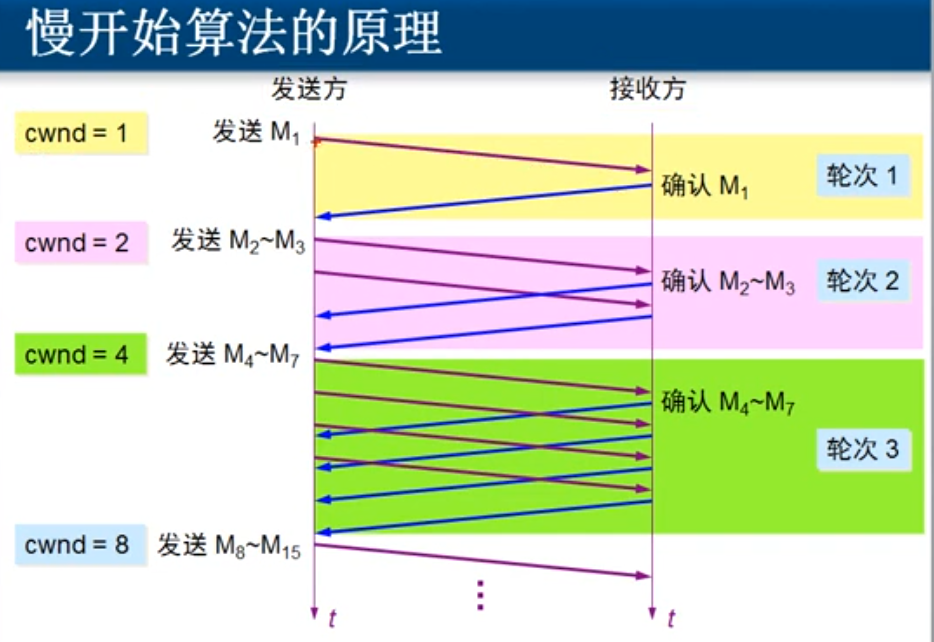

# 传输层

[TOC]

## 两个协议

TCP协议：需要将传输的文件分段再传输，CS之间要建立会话，以及流量控制，进行可靠传输。端口80 

UDP协议：一个数据包就可以传输，无需分段，**无需建立会话**，不需要流量控制，进行不可靠传输。

QQ聊天采用UDP协议，但是QQ传文件是TCP

### 常见的协议端口

HTTP：TCP 80

HTTPS：TCP 443

远程桌面协议 RDP： TCP 3389

FTP：TCP 21 

共享文件夹：TCP  445

发邮件协议 SMTP：TCP 25

收邮件协议 POP3：TCP 110

Telnet：TCP 23

SQL：TCP 1433

DNS：UDP 53

TCP：6    UDP：17    IGMP：1

### 服务和应用层之间的关系

一个Web服务器，上面部署若干服务：Web、FTP、SMTP、POP3，通过不同的端口对数据进行侦听，网卡会对请求的数据包进行端口号筛选过滤。其中当有些有漏洞服务开启，攻击者会通过该服务的端口号进行服务器攻击。

1. 服务使用TCP或UDP端口侦听客户端口的请求

2. 客户端使用IP地址定位服务器，使用目标端口定位服务

3. 可以在服务器网卡上只开放必要端口，实现服务器的网络安全

## 传输层的功能

传输层为**应用程序**提供了逻辑通信，而IP协议的功能是提供主机到主机之间的逻辑通信

### 端口的范围

0-65535

### UDP

不连接、不分段、不会话、不可靠、不拥塞控制

### TCP

可靠的、连接的、点对点通信、全双工（应答机制保证连接不中断）、

## 可靠传输

TCP是如何实现可靠传输的？

### 停止等待协议

可靠传输的的原理——**停止等待协议**，但信道利用率太低

发送确认，发送数据等待直到收到确认再发下一个数据包；超时重传，

确认丢失，会重传丢失的数据包；

### 自动重传请求ARQ

TD是发送数据包时间，TA收确认数据包的时间

提高信道利用率的方法：

### 连续ARQ协议（滑动窗口）

以字节为单位的滑动窗口技术

发送窗口当收到窗口第一个发送的数据包确认时，窗口滑动。接受端和发送端各有一个滑动窗口

如果丢了其中的一个包，会返回最长的连续确认包

因为网络条件的动态性，每隔一段时间会重新计算超时重传时间

## 流量控制

TCP是如何实现流量控制的？

### TCP报文首部

TCP首部报文中，封装源端口和目的端口。

TCP首部与IP首部一样，固定部分是20个字节，最长60个

1. 序号：数据部分第一个字节是整个文件的第多少个字节，我本次要发的第一个字节

2. 确认号：接收段确认下一次该发整个文件的第多少个字节，我该要哪个字节。如图所示

​		由于XP只向Web发送一个数据包，Web的确认号都是204

3. URG： （urgent）如果等于1，不排队
4. ACK：用于接收数据的确认。如果是0，确认号是无效的；如果是1，确认号是有效的
5. SYN： 用于建立请求 

| 序号 | ACK  | SYC  | 方向  |
| ---- | ---- | ---- | ----- |
| 0    | 0    | 1    | \to   |
| 0    | 1    | 1    | \gets |
| 1    | 1    | 0    | \to   |

> 你招手
>
> 妹子点头微笑并招手
>
> 你点头微笑

6. PUSH：数据包在接收端内存中不排队，直接插进去 
7. RST：如果为1，发生了严重错误，需要重新建立连接，如强制关闭程序
8. 窗口：两台主机的发送缓存和接受缓存、接受缓存和发送缓存 

滑动窗口

TCP协议如何避免网络堵塞

接受端通过**发送滑动窗口的大小**来控制发送端的发送窗口，从而控制发送数据。发送rwnd=0即让发送端暂停发送

## 拥塞控制

只要没有拥塞，就逐步增大窗口；只要出现拥塞，就缩小窗口

到达门限之前，滑动窗口按指数增长，到达门限后开始缓慢增长

快重传是如果收到一个没有顺序的报文就重复发确认，快恢复是拥塞窗口不从1开始

## TCP传输连接管理

客户：主动发起连接，建立应用进程的

### 三次握手

### 四次挥手

MSL最报文寿命

最后的等待时间是怕服务器没收到确认，一直等待下去

> 男：分手吧
>
> 女：我还有话没说完
>
> 女：我说完了，分手
>
> 男：好...（又等了很久，才独自离开，最终还是一个人承担了所有）