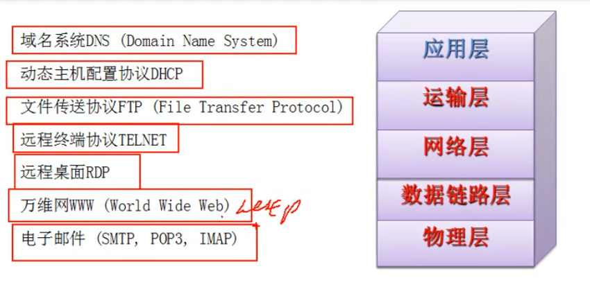
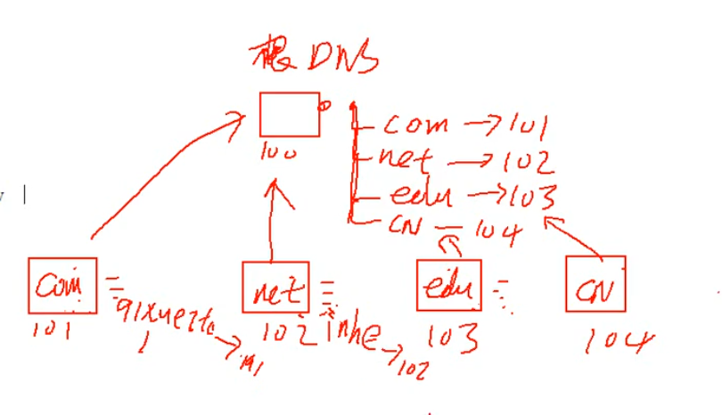
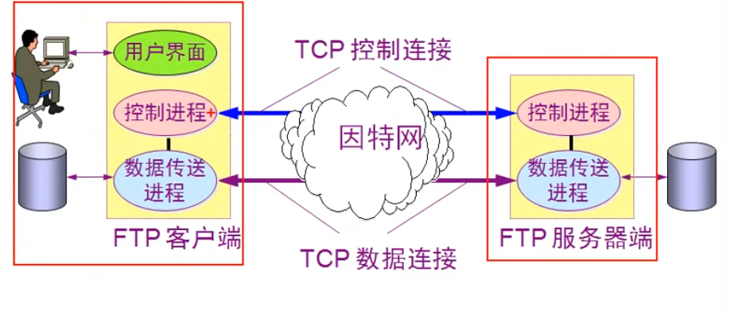
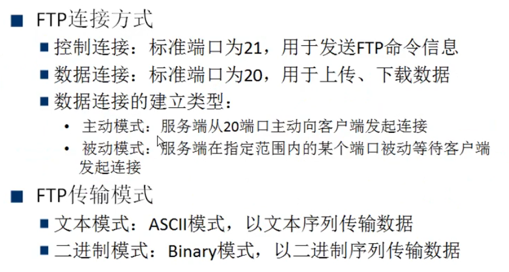
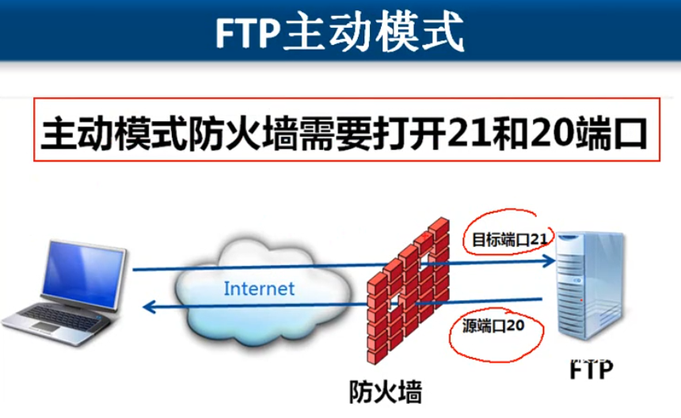
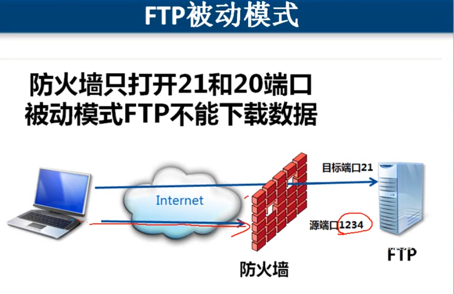
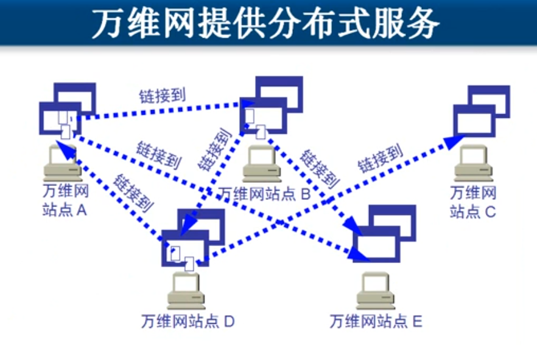
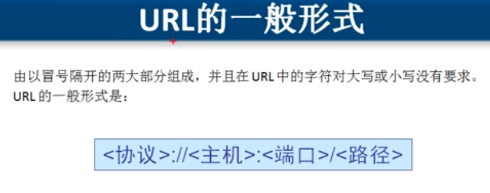

---

---

[TOC]

# 应用层 

每种协议对应一种服务

## DNS

DNS服务器的作用：将域名解析成IP地址，（域名解析是访问网站之前的操作）

域名：名称全球唯一

根 .

顶级域名：com    edu   net   cn   org   gov

二级域名:                       inhe.net（net下的域名）

三级域名：                    dba.inhe.net

DNS服务器采用分布式的查询技术

DNS根域名服务器，不负责具体的域名解析，但知道负责解析的服务器

## DHCP

动态主机配置协议，是一个局域网的网络协议

主机（DHCP客户端）通过DHCP协议请求IP地址，分为静态IP地址和动态IP地址

 DHCP客户端发送广播包，到达DHCP服务器后，从地址池中将地址发送回客户端，但DHCP服务器内的地址是静态分配（作用域）。

**跨网段地址分配**：一个网段需要一个作用域。

> 路由器可以隔绝广播域，因为只有配置网关和路由才能出去

## FTP

分成 控制连接 和 数据连接

主动模式：FTP客户端告诉FTP服务器要是用什么端口来侦听，FTP服务器与该端口建立连接。

 FTP服务器，如果有防火墙，需要开20和21端口，并采用主动模式

## Telnet

远程终端协议，默认使用23端口。它为用户提供了在本地计算机上完成远程主机工作的能力

## RDP

远程桌面协议

## HTTP

超文本传输协议，URL带http的就是利用HTTP协议

使用Web代理服务器访问网站优点

1. 节省内网访问Internet的带宽

> 在内网部署Web代理服务器，可以缓存部分访问过的内容，内部访问的话可以无需访问外网

2. 通过Web代理服务器可以绕过防火墙

> 在国外部署Web代理服务器，访问代理服务器从而重定向到目标服务器

3. 通过Web代理服务器可以避免IP跟踪

## 电子邮件（SMTP｜POP3｜IMAP）

每个email邮箱在服务器端都有一个“邮局”，在用户有email服务器的客户端，用户客户端可以将邮局的收件箱将邮件下载到本地，可查看邮件。发送邮件的时候，客户端先发送到自己的邮局（非匿名，会进行检查），放入发件箱中，邮局负责寻找目标地址的邮局，再放入邮局中的收件箱，对方通过客户端访问自己邮局的收件箱即可查阅邮件。

