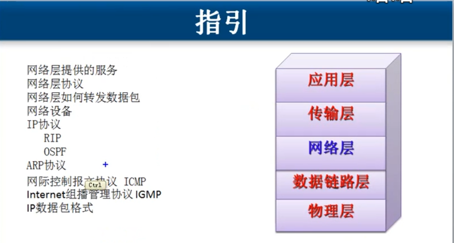
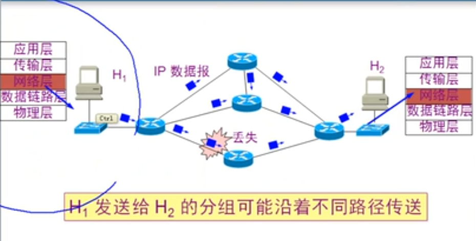
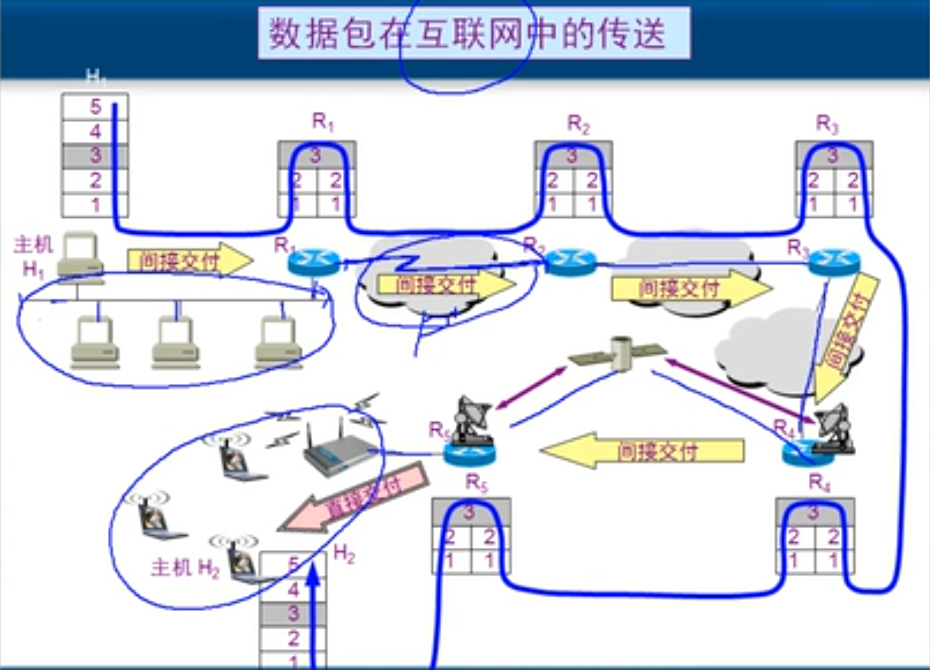
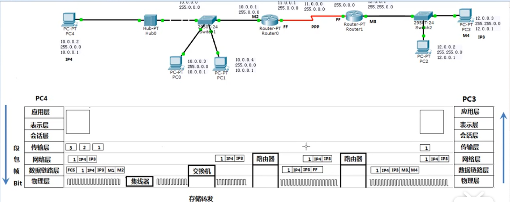
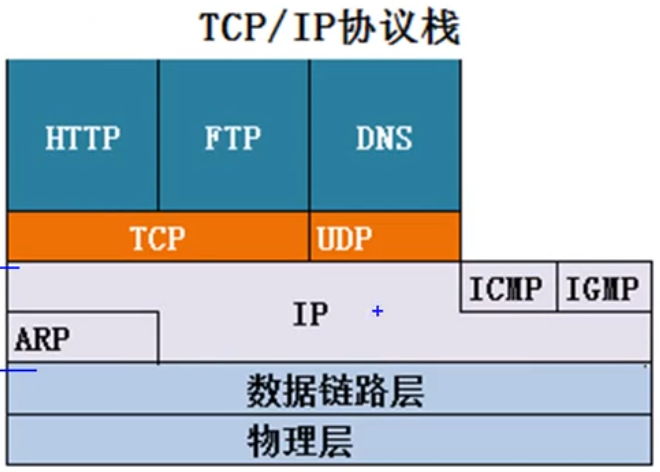
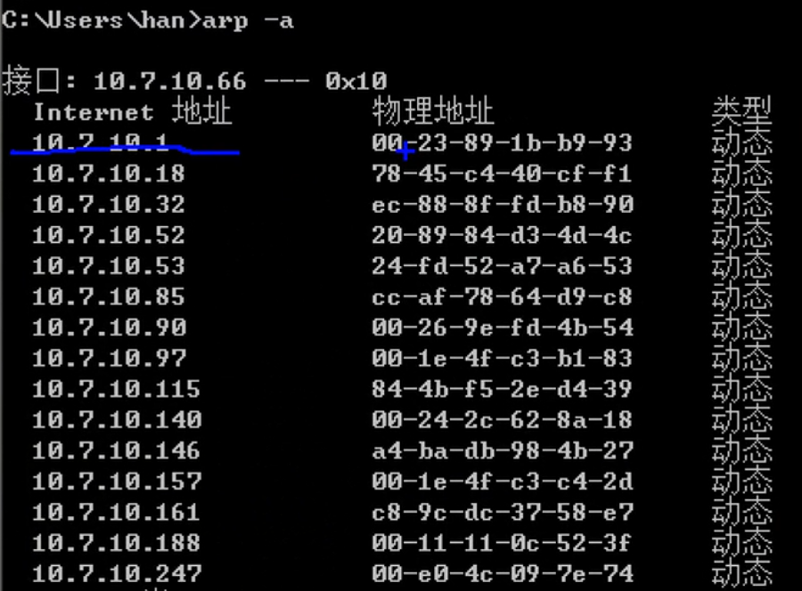
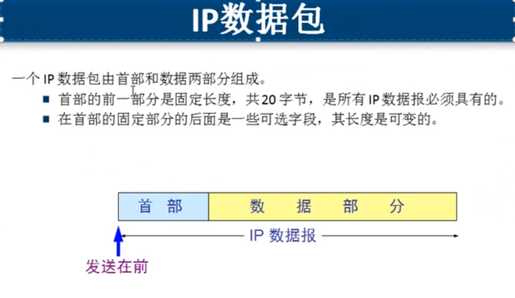
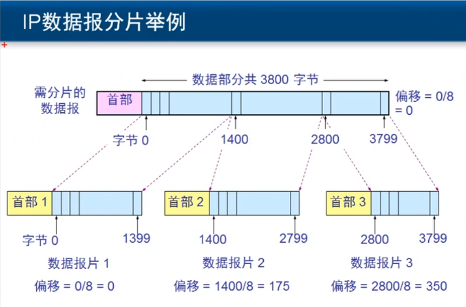
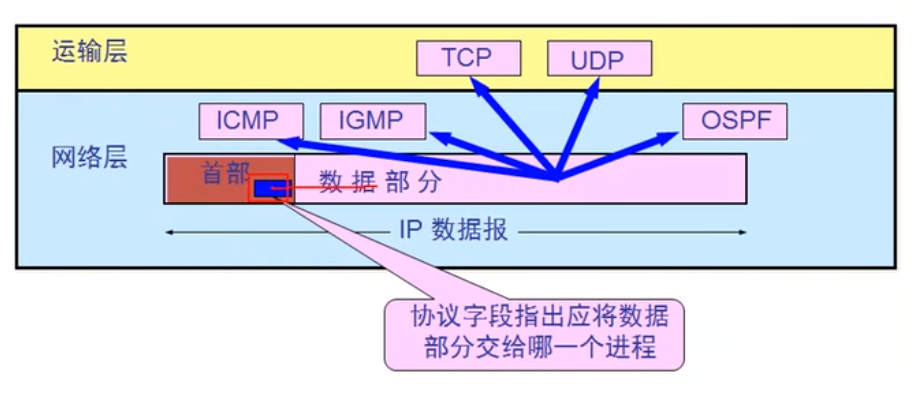
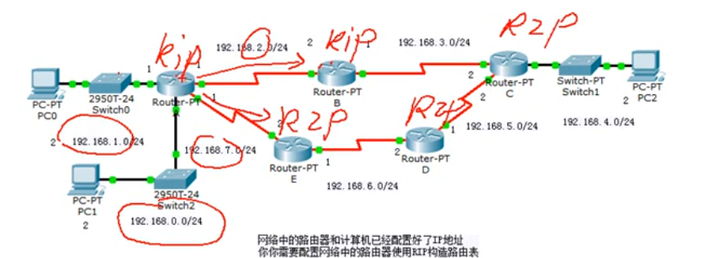

[TOC]

# 网络层

 

## 网络层提供的服务

网络层主要负责在不同网络之间 尽力基于IP地址转发数据包，不负责丢失重传。（**数据转发**）

网络层为传输层提供两种服务

* 虚电路：建立一条虚拟的连接
* 数据报：提供无连接的、尽最大能力交付的数据报，发送分组不需要建立连接，不保证服务质量

**传输层**负责将数据分段编号，再进行传输，**网络层**为其加上目标地址和源地址，**数据链路层**路过一个转发装置将下一跳的MAC地址重新封装；

> 正常情况下，路由器肯定不会修改数据包的源地址和目标地址，只是路由器启用NAT功能后,会将IP地址和TCP端口绑定重新定义一个出口IP地址和新的端口号

## 数据传输过程

首先使用自己的子网掩码判断自己和目标地址在哪个网段。如果是同一个网段，通过 *ARP协议广播* 解析目标地址的MAC地址；如果不在同一个网段，下一跳的MAC地址是网关地址，如果没有网关地址就不能跨网传输。但数据帧的每一跳都会重新封装下一跳的数据帧，表示下一跳去哪

**网关**即一个网络连接另一个网络的关口，数据出口，要出去数据必须要知道或经过的地址

交换机的功能：存储转发仅能根据MAC地址，所以是二层设备

>  病毒可以在网络设备上运行么？
>
> 病毒是应用程序，传输过程中在传输层分成不同的数据段，无法正常工作

## 网络层协议

ARP——IP——ICMP/IGMP，一个为一个提供服务

### ARP

地址解析协议，即*ARP*（Address Resolution Protocol）。在一个网段内，通过广播获得目标IP地址的MAC地址对应表。

通过使用arp -a查看

> ARP欺骗：其实是另外一台计算机充当“黑中介”，再两台物理机之间充当一个交换机。ARP广播找目标IP地址的MAC地址，欺骗者收到广播帧会返回一个假MAC地址对应表，使其发给自己 

### ICMP

网际控制报文协议（Internet Control Message Protocol）。常用ping命令

### IGMP

网际组管理协议（Internet Group Management Protocol），协议配置在路由器的接口上，周期性扫描网段，查看那些计算机绑定多播地址，确定是否转发多播信号。

IGMP报文实现组成员管理功能，IGMP报文封装在IP报文中。

MAC帧类型分成单播帧（点到点）、组播（又叫多播）、广播

## IP数据包

每一行是4个字节32位，一共5行，所以IP首部固定长度是20个字节。

1. 版本：4位，哪个版本的TCP/IP协议，IPv4 or IPv6
2. 首部长度：4位，就是首部是多少个字节。一行32位=4byte，固定部分一共5行，固定首部一共20byte，由于首部长度那一栏是4位，用0101表示20byte，那么最大可以是1111，所以首部最大到15*4=60byte
3. 区分服务：标记为优先服务
4. 总长度：整个IP数据包的长度，即字节数，占16位，用这个长度来计数，可以最高容纳216-1=65535字节，MAC帧最长也才1500字节，需要将**数据包分片**传输，片上最多传1480个字节。【计算机怎么计数呢，只能通过0-1二进制，位数限制了计数大小】
5. 标识：同一个数据报的各个分片的标识是一样的
6. 标志：占3位，目前只有两位有意义，最后一位是1表示还有分片，0表示最后一个分片；第二位为0表示可以分片

7. 生存时间（TTL）：过一个路由器减1
8. 协议号：ICMP协议号是1，IGMP 2，TCP 6，UDP 17，IPv6 41，OSPF 89

## IP协议

IP协议：能够自动学习路由表的协议的统称

### 静态路由

静态路由需要网管配置路由器，所有没有直连网络下一跳的地址 

### 动态路由

RIP协议：路由器广播RIP数据包，说明自己连接的网段和跳数，以跳数为权重；周期性广播路由表 ，最大跳数15，30秒更新一次（随时得知连接状态）

OSPF协议是以带宽为权重