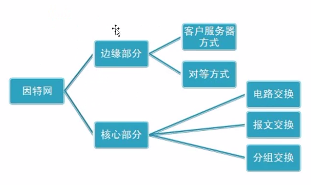

### 建立知识体系的过程：

因特网的概述：功能（2）和发展（3）
因特网的组成：2
计算机网络类别 3
计算机网络的性能

* * *
网络、因特网、互联网

网络一般不超过100米

发展：

多层次的ISP

有些服务器托管到电信运营商的机房，或者购买云服务

`因特网的组成：`

 
路由器的存储转发功能：

计算机网络的分类

实体n+1 发送给另一个实体n+1，需要通过服务访问点传给实体n，给另一个实体n，再传给实体n+1

