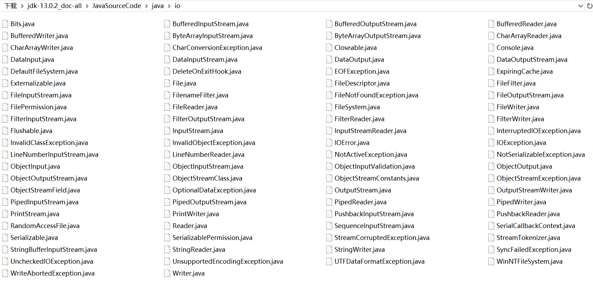
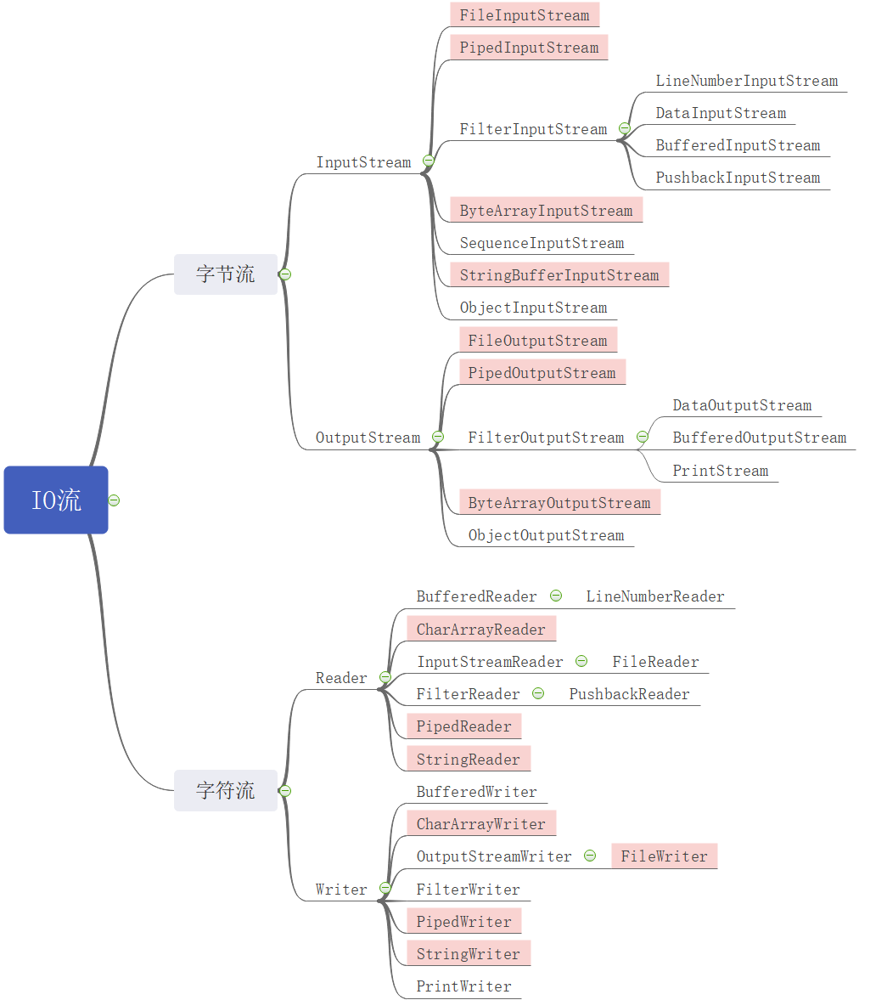

## 流的分类

java.io 包下包含了多种流类型（类和抽象类）来实现输入输出。如下图所示：



这些流按照不同的规则可以划分如下：

- 按照流的方向可以划分为**输入流**和**输出流**。
- 按照流处理数据的单位可以划分为**字节流**和**字符流**。
- 按照流的功能可以划分为**节点流**和**处理流**。

### FAQs

- **一个程序使用流从文件中读取数据，在程序的角度，该流为输入流，但在文件的角度，该流为输出流，那么我们在判断一个流为输入流还是输出流时，其站在程序的角度还是文件的角度？**

  **答**：始终站在程序的角度。

- **什么是字节流，什么是字符流？**

  **答**：节点流就是一个字节一个字节的读取的流，字符流就是一个字符一个字符读取的流。（在 java 中一个字符，char， 占两个字节，即 16 位）。

- **有了字节流，为何还要有字符流？**

  答：字节流只能一个字节一个字节的读取，当读取文本文件时，一个字符占两个字节，使用字节流读取时会出现问题。

- **字节流和字符流通常的应用场景有哪些？**

  **答**：

  - 字节流通常用于处理二进制文件。例如，图片，视频，音频文件。
  - 字符流通常用于处理文本文件。

- **什么是节点流，什么是处理流？**

  **答**：节点流就是从一个数据源（节点）直接读取数据。处理流就是套在其它流之上，提供更加强大的数据处理功能的流。

- **有了节点流，为何还要有处理流？**

  **答**：节点流的功能比较少，处理流可以在其它流的之上，提供更加强大的功能。

## 流的四个抽象基类

java.io 包中所有的流类型都分别继承了 java.io 内的四个抽象类：

|        | 字节流       | 字符流 |
| ------ | ------------ | ------ |
| 输入流 | InputStream  | Reader |
| 输出流 | OutputStream | Writer |

下图为 IO 流的继承图（其中深色为节点流，浅色为处理流）：



## 四个抽象基类提供的基本方法

### InputStream 的基本方法

```java
int read() throws IOException;
// 读取一个字节，并以整形的形式返回（0~255）
// 如果返回 -1，表示已经到了流的末尾
```

```java
int read(byte[] buffer) throws IOException;
// 读取一系列字节，然后存储到 buffer 字节数组中
// 返回实际读取到的字节数
// 如果返回 -1，表示已经到了流的末尾
```

```java
int read(byte[] buffer, int offset, int length) throws IOException;
// 读取 length 个字节
// 从 buffer[offset] 位置开始将读取到的字节保存到 buffer 中
// 返回实际读取到的字节数
// 如果返回 -1，表示已经到了流的末尾
```

```java
void close() throws IOException;
// 关闭流释放内存资源
```

### OutputStream 的基本方法

```java
void write(int b) throws IOException;
// 向输出流中写入一个字节数据，该字节数据为整形参数 b 的低 8 位
```

```java
void write(byte[] b) throws IOException;
// 将一个字节类型的数组中的数据写入到输出流
```

```java
void write(byte[] b, int offset, int length) throws IOException;
// 将字节类型数组 b 中，从 b[offset] 开始，长度为 length 的数据写入到输出流
```

```java
void flush() throws IOException;
// 将输出流中缓冲的数据全部写入到目的地
```

```java
void close() throws IOException;
// 关闭流并且释放内存资源
```

**注意**：<font color="red">在使用输出流时，在关闭输出流之前，先调用 `flush()` 方法。</font>

### Reader 的基本方法

```java
int read() throws IOException;
// 读取一个字符，并以整形的形式返回（0~65535）
// 如果返回 -1，表示已经到了流的末尾
```

```java
int read(char[] cbuff) throws IOException;
// 读取一系列字符，并且存储到 cbuff 字符数组中
// 返回实际读取到的字符数
// 如果返回 -1，表示已经到了流的末尾
```

```java
int read(char[] cbuff, int offset, int length) throws IOException;
// 读取 length 个字符
// 从 cbuff[offset] 位置开始将读取到的字符保存到 cbuff 中
// 返回实际读取到的字符数
// 如果返回 -1，表示已经到了流的末尾
```

```java
void close() throws IOException;
// 关闭流并且释放内存资源
```

### Writer 的基本方法

```java
void write(int b) throws IOException;
// 向输出流中写入一个字符数据，该字符数据为整形参数 b 的低 16 位
```

```java
void write(char[] cbuff) throws IOException;
// 将一个字符类型的数组中的数据写入到输出流
```

```java
void write(char[] cbuff, int offset, int length) throws IOException;
// 将字符类型数组 cbuff 中，从 cbuff[offset] 开始，长度为 length 的数据写入到输出流
```

```java
void write(String string) throws IOException;
// 将一个字符串写入到输出流
```

```java
void write(String string, int offset, int length) throws IOException;
// 将一个字符串 string 中，从 offset 下标位置开始，长度为 length 的子串写入到输出流
```

```java
void flush() throws IOException;
// 将输出流中缓冲的数据全部写入到目的地
```

```java
void close() throws IOException;
// 关闭流并且释放内存资源
```

